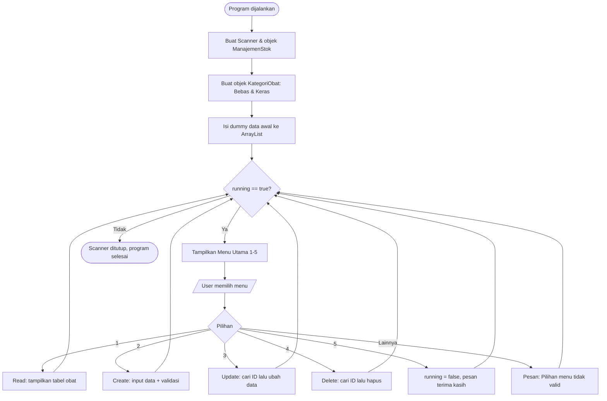

# Minpro 2 PBO - Manajemen Stok Obat pada Apotek
 
Program **Sistem Manajemen Stok Obat pada Apotek** berbasis Java (CLI/console) yang dibuat untuk **Mini Project 2 – Pemrograman Berorientasi Objek (PBO)**. Program ini merupakan lanjutan dari Mini Project 1.

- **Nama:** Muhammad Ihsan Kamil
- **NIM:** 2509116035
- **Praktikum:** Pemrograman Berorientasi Objek (PBO)
  
---
 
## 1. Deskripsi Singkat Program
 
**Sistem Manajemen Stok Obat Apotek** adalah aplikasi console untuk membantu apotek mencatat dan mengelola data obat. Program menyediakan fitur **CRUD** (Create, Read, Update, Delete):
 
| Menu | Fitur | Keterangan |
|------|-------|------------|
| 1 | Tampilkan Semua Obat | **Read** – menampilkan seluruh data obat dalam bentuk tabel |
| 2 | Tambah Obat Baru | **Create** – menambah obat baru (Obat Bebas / Obat Keras) |
| 3 | Ubah Data Obat | **Update** – mengubah nama, stok, dan harga berdasarkan ID |
| 4 | Hapus Obat | **Delete** – menghapus obat berdasarkan ID |
| 5 | Keluar | Mengakhiri program |
 
Obat dibagi menjadi dua jenis:
 
- **Obat Bebas** → dapat dibeli tanpa resep, menyimpan informasi **efek samping**.
- **Obat Keras (Obat Resep)** → harus dengan resep dokter, menyimpan informasi **nama dokter**.
Data disimpan sementara di dalam `ArrayList<Obat>`, sehingga data akan kembali ke data dummy awal setiap program dijalankan ulang.
 
---
 
## 2. Struktur Package (MVC)
 
Program dipisah ke dalam tiga package sesuai pola **MVC (Model – View – Controller)**:
 
```
Minpro-2-PBO-ManajemenStokObatApotek/
└── src/
    ├── Model/
    │   ├── KategoriObat.java     
    │   ├── Obat.java             
    │   ├── ObatBebas.java        
    │   └── ObatResep.java        
    ├── Controller/
    │   └── ManajemenStok.java    
    └── View/
        └── Main.java             
```
 
| Package | File | Peran |
|---------|------|-------|
| `Model` | `KategoriObat.java` | Menyimpan data kategori obat (nama kategori & deskripsi) |
| `Model` | `Obat.java` | **Superclass** – atribut & perilaku umum semua obat (ID, nama, stok, harga, kategori) |
| `Model` | `ObatBebas.java` | **Subclass** dari `Obat` – menambah atribut `efekSamping` |
| `Model` | `ObatResep.java` | **Subclass** dari `Obat` – menambah atribut `namaDokter` |
| `Controller` | `ManajemenStok.java` | Logika bisnis: menyimpan `ArrayList<Obat>` dan operasi CRUD |
| `View` | `Main.java` | Antarmuka pengguna: menu, input dari keyboard, dan validasi input |
 
**Alasan pemisahan:**
 
- **Model** hanya berisi data dan aturan datanya, tanpa tahu bagaimana data diambil dari user.
- **Controller** berisi logika pengelolaan data (tambah, cari, ubah, hapus) dan tidak berinteraksi dengan `Scanner`.
- **View** hanya mengurus tampilan menu dan pengambilan input, lalu meneruskannya ke Controller.
---
 
## 3. Alur Program (Run sampai Menu 5)
 
### 3.1 Diagram Alur
 

 
### 3.2 Penjelasan Alur Langkah demi Langkah
 
#### Program Dijalankan (Run)
 
1. Method `main()` di `Main.java` dieksekusi.
2. Dibuat objek `Scanner` untuk membaca input keyboard.
3. Dibuat objek `ManajemenStok app` (Controller) yang di dalamnya sudah ada `ArrayList<Obat>` kosong.
4. Dibuat dua objek kategori:
   - `bebas` → `"Obat Bebas"`, `"Dapat dibeli tanpa resep"`
   - `keras` → `"Obat Keras"`, `"Harus dengan resep dokter"`
5. **Dummy data awal** dimasukkan ke `ArrayList`:
   - `OBT01` – Paracetamol – stok 50 – Rp 5.000 – Obat Bebas – efek samping "Mengantuk"
   - `OBT02` – Amoxicillin – stok 20 – Rp 12.000 – Obat Keras – dokter "dr. Rizki"
6. Variabel `running = true` dan program masuk ke perulangan `while (running)`.
**Screenshot: Program pertama kali dijalankan**
 

 
---
 
#### Menu Utama
 
Setiap iterasi perulangan menampilkan:
 
```
=== SISTEM MANAJEMEN STOK OBAT APOTEK ===
1. Tampilkan Semua Obat (Read)
2. Tambah Obat Baru (Create)
3. Ubah Data Obat (Update)
4. Hapus Obat (Delete)
5. Keluar
Pilih menu (1-5):
```
 
Input dibaca dengan `scanner.nextLine().trim()` lalu diproses menggunakan `switch`. Jika input bukan `1`–`5`, masuk ke `default` dan muncul pesan **"Pilihan menu tidak valid!"** lalu menu ditampilkan kembali.
 
**Input menu tidak valid**


---

#### Menu 1: Tampilkan Semua Obat (Read)
 
1. `app.tampilkanSemuaObat()` dipanggil.
2. Jika `daftarObat` kosong → tampil pesan **"Stok obat masih kosong."**
3. Jika ada data → dicetak header tabel (ID, Nama Obat, Kategori, Stok, Harga, Keterangan Khusus).
4. Perulangan `for` memanggil `o.tampilkanInfo()` untuk setiap obat. Karena **polymorphism**, obat bebas menampilkan `Efek: ...` sedangkan obat resep menampilkan `Dokter: ...`.
**Tampilan data dummy langsung muncul saat menu 1 dipilih**
 

 
**Menu 1 saat data kosong (setelah semua data dihapus)**
 


---
 
#### Menu 2: Tambah Obat Baru (Create)
 
Urutan input:
 
1. **ID Obat** (teks)
2. **Nama Obat** (teks)
3. **Jumlah Stok** → divalidasi oleh `inputInt()` (harus bilangan bulat)
4. **Harga Obat** → divalidasi oleh `inputDouble()` (harus angka)
5. **Kategori Obat**:
   - `1` → Obat Bebas → lanjut input **Efek Samping** → objek `ObatBebas` dibuat
   - `2` → Obat Keras → lanjut input **Nama Dokter** → objek `ObatResep` dibuat
   - Selain itu → pesan **"Pilihan kategori tidak valid!"** dan data tidak disimpan
6. Objek baru dimasukkan ke `ArrayList` lewat `app.tambahObat(...)`, lalu tampil pesan **"Data obat berhasil ditambahkan!"**
**Proses tambah obat Bebas (Kategori 1)**
 


**Proses tambah obat Keras (Kategori 2)**
 


**Validasi input salah (mengetik huruf pada Stok/Harga)**
 


**Pilihan kategori tidak valid**
 

 
---
 
#### Menu 3: Ubah Data Obat (Update)
 
1. User memasukkan **ID Obat** yang ingin diubah.
2. Program mencari dengan `cariObatById()` (tidak membedakan huruf besar/kecil karena memakai `equalsIgnoreCase`).
3. Jika ditemukan, user mengisi **Nama Baru**, **Stok Baru** (`inputInt`), **Harga Baru** (`inputDouble`).
4. `app.updateObat(...)` memanggil setter `setNamaObat()`, `setStok()`, `setHarga()` pada objek.
5. Jika berhasil tampil **"Data obat berhasil diubah!"**, jika ID tidak ada tampil **"ID Obat tidak ditemukan!"**.
> Setter `setStok()` dan `setHarga()` otomatis mengubah nilai negatif menjadi `0`.
 
**Update data obat berhasil**
 

 
**Update dengan ID yang tidak ditemukan**
 

 
#### Menu 4: Hapus Obat (Delete)
 
1. User memasukkan **ID Obat** yang ingin dihapus.
2. `app.hapusObat(id)` mencari obat, lalu menghapusnya dari `ArrayList`.
3. Jika berhasil tampil **"Obat berhasil dihapus!"**, jika tidak ada tampil **"ID Obat tidak ditemukan!"**.
**Hapus obat berhasil**
 

 
**Hapus dengan ID tidak ditemukan**
 

 
---
 
#### Menu 5: Keluar
 
1. Variabel `running` diubah menjadi `false`.
2. Tampil pesan **"Terima kasih telah menggunakan sistem ini."**
3. Perulangan `while` berhenti, `scanner.close()` dipanggil, dan program selesai.
**Keluar dari program**
 

 
---
 
## 4. Penjelasan Penerapan Ketentuan Umum
 
### 4.1 Validasi Input
 
| Bentuk Validasi | Lokasi | Penjelasan |
|-----------------|--------|------------|
| Validasi angka bulat | `View/Main.java` → `inputInt()` | Memakai `hasNextInt()` dalam `while(true)`. Jika bukan bilangan bulat, muncul pesan **"Input salah! Masukkan angka bulat."** dan user diminta mengulang sampai benar. Dipakai untuk input **stok**. |
| Validasi angka desimal | `View/Main.java` → `inputDouble()` | Memakai `hasNextDouble()`. Jika bukan angka, muncul pesan **"Input salah! Masukkan angka desimal/bulat."** dan diulang. Dipakai untuk input **harga**. |
| Validasi menu | `View/Main.java` → `switch` `default` | Pilihan selain 1–5 menampilkan **"Pilihan menu tidak valid!"**. |
| Validasi kategori | `View/Main.java` → menu 2 | Pilihan selain 1/2 menampilkan **"Pilihan kategori tidak valid!"** dan data tidak disimpan. |
| Validasi ID tidak ditemukan | `Controller/ManajemenStok.java` → `updateObat()` & `hapusObat()` | Mengembalikan `false` jika ID tidak ada, lalu View menampilkan pesan gagal. |
| Validasi data kosong | `Controller/ManajemenStok.java` → `tampilkanSemuaObat()` | Jika list kosong, tampil **"Stok obat masih kosong."** |
| Pembersihan spasi | `View/Main.java` | Semua input teks memakai `.trim()` agar spasi berlebih di awal/akhir dihapus. |
 
### 4.2 Access Modifier
 
| Modifier | Penerapan | Contoh |
|----------|-----------|--------|
| `private` | Semua atribut dibuat private agar tidak bisa diakses langsung dari luar class | `private String idObat;`, `private int stok;`, `private ArrayList<Obat> daftarObat;`, `private String efekSamping;`, `private String namaDokter;` |
| `private static` | Method bantu di `Main` yang hanya dipakai di dalam class itu | `inputInt()`, `inputDouble()` |
| `public` | Class, constructor, dan method yang memang perlu diakses class lain | `public class Obat`, `public void tampilkanInfo()`, `public boolean hapusObat()`, getter & setter |
 
### 4.3 Encapsulation (Getter dan Setter)
 
Seluruh atribut bersifat `private` dan hanya bisa diakses melalui getter/setter:
 
| Class | Atribut Private | Getter | Setter |
|-------|-----------------|--------|--------|
| `Obat` | `idObat` | `getIdObat()` | – (ID tidak boleh diubah setelah dibuat) |
| `Obat` | `namaObat` | `getNamaObat()` | `setNamaObat()` |
| `Obat` | `stok` | `getStok()` | `setStok()` |
| `Obat` | `harga` | `getHarga()` | `setHarga()` |
| `Obat` | `kategori` | `getKategori()` | `setKategori()` |
| `KategoriObat` | `namaKategori` | `getNamaKategori()` | `setNamaKategori()` |
| `KategoriObat` | `deskripsi` | `getDeskripsi()` | `setDeskripsi()` |
 
**Poin penting:**
`ManajemenStok` mengubah data obat lewat setter (`o.setNamaObat()`, `o.setStok()`, `o.setHarga()`), bukan mengakses atribut langsung.
  
### 4.4 Inheritance
 
Program memiliki **1 superclass** dan **2 subclass**:
 
```
            ┌────────────────────┐
            │   Obat (Superclass)│
            │ idObat, namaObat,  │
            │ stok, harga,       │
            │ kategori           │
            └─────────┬──────────┘
          extends     │     extends
      ┌───────────────┴───────────────┐
┌─────▼───────────┐           ┌───────▼─────────┐
│ ObatBebas       │           │ ObatResep       │
│ + efekSamping   │           │ + namaDokter    │
└─────────────────┘           └─────────────────┘
```
 
| Class | Peran | Atribut Tambahan | Lokasi |
|-------|-------|------------------|--------|
| `Obat` | Superclass | – | `Model/Obat.java` |
| `ObatBebas` | Subclass 1 (`extends Obat`) | `efekSamping` | `Model/ObatBebas.java` |
| `ObatResep` | Subclass 2 (`extends Obat`) | `namaDokter` | `Model/ObatResep.java` |
 
Kedua subclass memakai `super(...)` di constructor untuk memanggil constructor `Obat`, sehingga atribut umum (ID, nama, stok, harga, kategori) tidak perlu ditulis ulang. Subclass hanya menambahkan atribut khususnya.
 
### 4.5 Dummy Data Awal
 
Dummy data dimasukkan di awal `main()` (`View/Main.java`) **sebelum menu ditampilkan**, sehingga menu 1 langsung menampilkan data tanpa input manual.
 
| ID | Nama | Jenis | Stok | Harga | Keterangan |
|----|------|-------|------|-------|------------|
| OBT01 | Paracetamol | ObatBebas | 50 | Rp 5.000 | Efek: Mengantuk |
| OBT02 | Amoxicillin | ObatResep | 20 | Rp 12.000 | Dokter: dr. Rizki |
 
Jumlah dummy data: **2 data** (ketentuan minimal 1 data).
 
---
 
## 5. Penjelasan Nilai Tambah
 
> Nilai tambah yang diterapkan: **(1) Struktur MVC** dan **(2) Polymorphism (Method Overriding dan Method Overloading)**.
 
### 5.1 Struktur MVC
 
Penjelasan lengkap struktur package ada di bagian 2. Ringkasan letak penerapan:
 
| Komponen MVC | Package | File | Tanggung Jawab |
|--------------|---------|------|----------------|
| **Model** | `Model` | `KategoriObat`, `Obat`, `ObatBebas`, `ObatResep` | Representasi data dan aturan datanya |
| **View** | `View` | `Main` | Menampilkan menu, membaca input, menampilkan pesan |
| **Controller** | `Controller` | `ManajemenStok` | Mengelola `ArrayList<Obat>` dan operasi CRUD |
 
**Alur kerja antar-komponen:** `View (Main)` menerima input user → memanggil method di `Controller (ManajemenStok)` → Controller mengolah objek `Model (Obat, dst.)` → hasilnya dikembalikan ke View untuk ditampilkan.
 
### 5.2 Polymorphism
 
#### a. Method Overriding
 
Method `tampilkanInfo()` didefinisikan di superclass `Obat` (mencetak kolom ID, nama, kategori, stok, harga), lalu **di-override** oleh kedua subclass dengan `@Override`:
 
| Class | Lokasi | Hasil Tambahan pada Output |
|-------|--------|----------------------------|
| `Obat` | `Model/Obat.java` | Kolom umum saja |
| `ObatBebas` | `Model/ObatBebas.java` | Kolom umum + `Efek: <efekSamping>` |
| `ObatResep` | `Model/ObatResep.java` | Kolom umum + `Dokter: <namaDokter>` |
 
Variabel bertipe `Obat`, tetapi Java menjalankan versi `tampilkanInfo()` milik `ObatBebas` atau `ObatResep` sesuai objek sebenarnya (*dynamic method dispatch*).
 
#### b. Method Overloading
 
Method `tambahObat()` di `Controller/ManajemenStok.java` memiliki dua versi dengan parameter berbeda:
 
| Versi | Parameter | Fungsi |
|-------|-----------|--------|
| 1 | `tambahObat(Obat obat)` | Menambah **satu** obat |
| 2 | `tambahObat(ArrayList<Obat> listBaru)` | Menambah **banyak** obat sekaligus |
 
---
 
<p align="center">Dibuat oleh <b>Muhammad Ihsan Kamil</b> – Pemograman Berbasis Objek</p>
